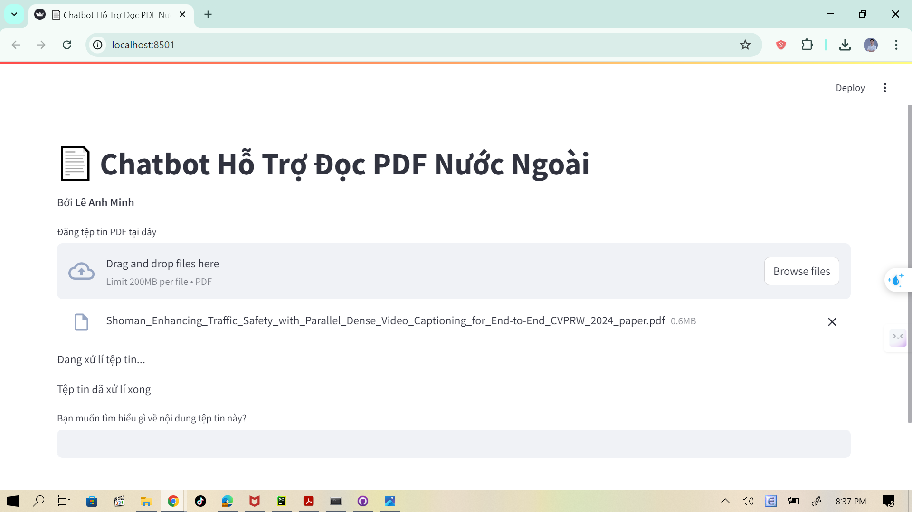

# **Chatbot for Supporting Vietnamese People in Reading English Documents**

### **Project Overview**
This project creates a chatbot that helps Vietnamese users read and understand documents in English. 

### **Features**
- **Bilingual Support**: Allows Vietnamese users to interact with English documents easily.
- **RAG Architecture**: Uses LLaMA 3 in a Retrieval-Augmented Generation (RAG) framework to provide accurate answers from the PDF document.
- **Streamlit Interface**: A simple interface for users to upload documents and ask questions.

### **Technologies**
- **LLaMA 3** for RAG.
- **FAISS** for similarity search.
- **MarianMT** for translation between English and Vietnamese.
- **Streamlit** to build the user interface.

### **Installation**
1. Clone the repository:
   ```bash
   git clone https://github.com/AnhMinh-Le/Chatbot-RAG-Translator.git
   cd Chatbot-RAG-Translator

2. Install the required libraries via setup.txt:
   ```bash
    pip install -r setup.txt


3. Add your Hugging Face API key to the `huggingface.env` file:
   ```bash
   HUGGINGFACEHUB_API_TOKEN=YOUR_HUGGINGFACE_API_TOKEN


4. Run the application:
   ```bash
   streamlit run app.py

### **Usage**
- Upload an English PDF file.
- Ask questions in Vietnamese.
- Receive accurate answers, translated from the content of the PDF.

### **File Structure**
- `app.py`: The main file to run the Streamlit application.
- `pdf_process.py`: Handles PDF document processing and content extraction.
- `translate.py`: Translates questions and answers between Vietnamese and English.

### **Future Improvements**
- Expand support for various types of documents.
- Improve the accuracy of answers using advanced search algorithms.
- Add user feedback to improve the model over time.

### **Demo**


